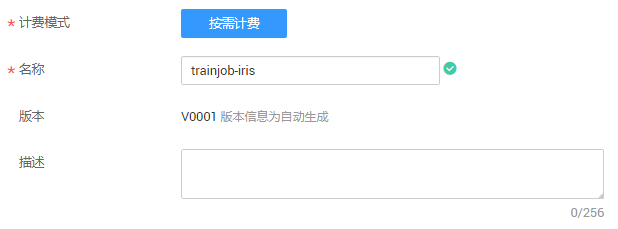
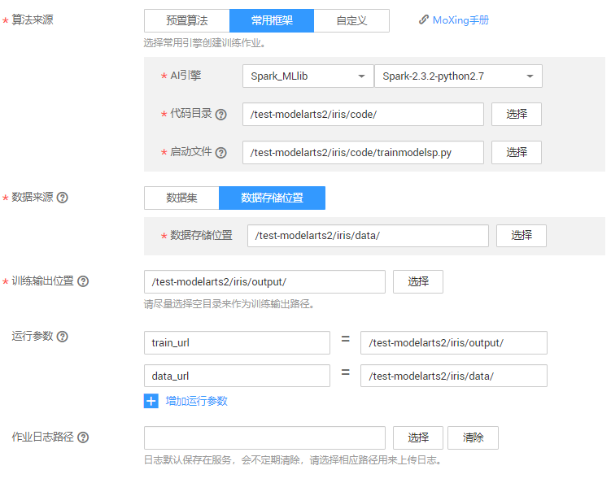
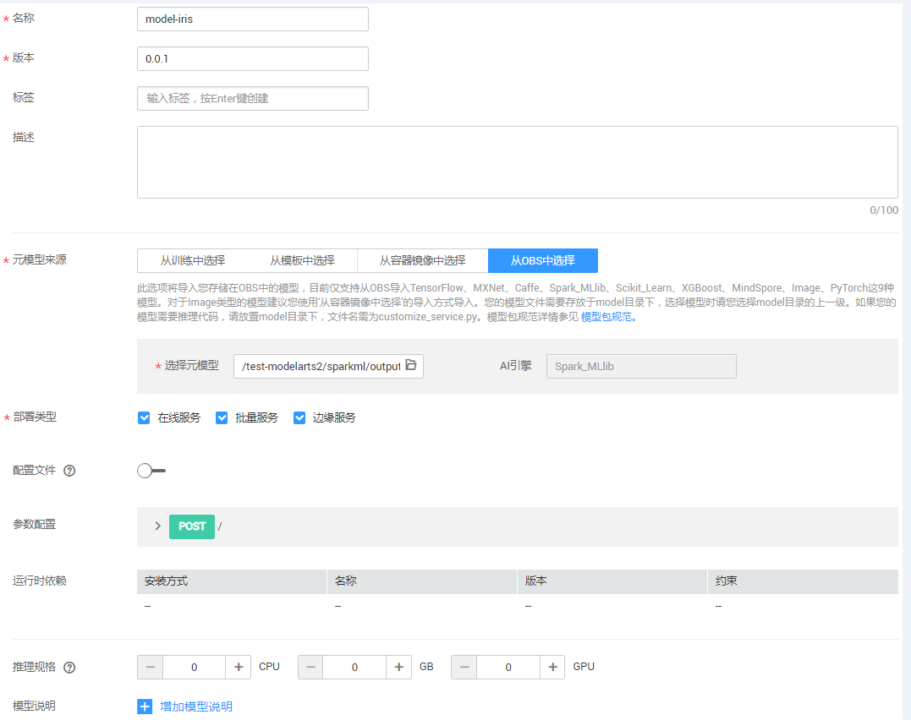
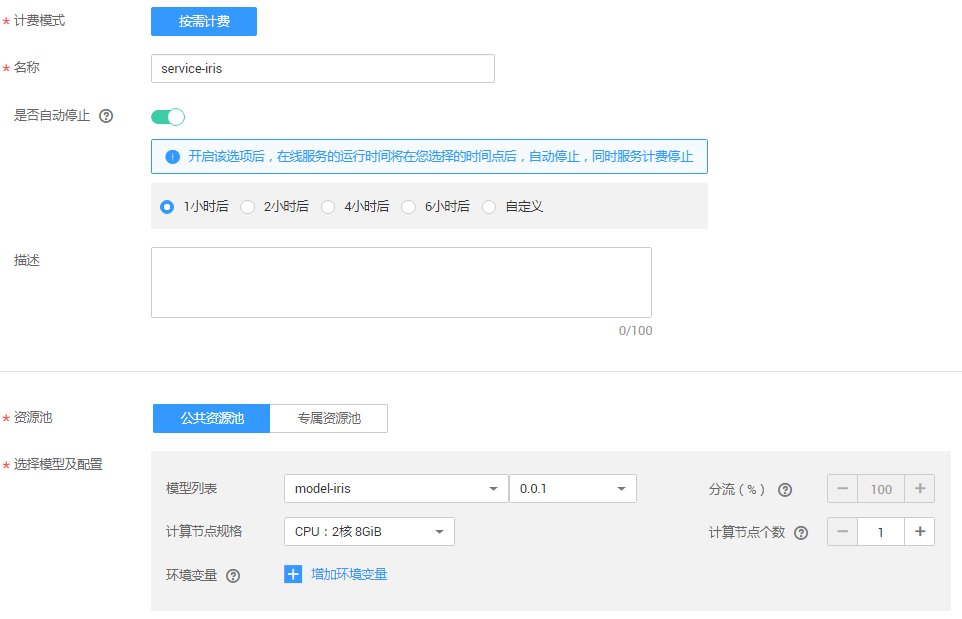

# 使用Spark MLlib实现鸢尾花卉分类预测<a name="modelarts_10_0016"></a>

IRIS也称鸢尾花卉数据集，是一类多重变量分析的数据集。数据集包含150个数据集，分为3类，每类50个数据，每个数据包含4个属性。可通过花萼长度，花萼宽度，花瓣长度，花瓣宽度4个属性预测鸢尾花卉属于（Setosa，Versicolour，Virginica）三个种类中的哪一类。

本示例介绍如何使用Spark MLlib引擎实现鸢尾花卉分类预测的应用。鸢尾花卉分类预测样例的操作流程如下所示。

1.  **[准备数据](#section055233642011)**：下载数据集、示例代码，然后上传至OBS桶中。
2.  **[训练模型](#section15883611781)**：编写基于Spark MLlib中ALS算法的模型训练脚本，新建训练作业进行模型训练。
3.  **[部署模型](#section7124946131216)**：得到训练好的模型文件后，新建预测作业将模型部署为在线预测服务。
4.  **[预测结果](#section773012861716)**：发起预测请求获取预测结果。

## 准备数据<a name="section055233642011"></a>

ModelArts提供了用于训练的数据集和示例代码，执行如下步骤，下载数据集和示例代码，并上传至OBS中。

1.  在gitee的[ModelArts-Lab](https://gitee.com/ModelArts/ModelArts-Lab)工程中，单击“克隆/下载“，然后单击“下载ZIP“，下载工程。
2.  <a name="li4572151143318"></a>下载完成后，解压缩“ModelArts-Lab-master.zip“文件，然后在“\\ModelArts-Lab-master\\official\_examples\\Using\_Spark\_MLlib\_to\_Create\_a\_Flower\_Classification\_Application“目录中获取到训练数据集“iris.csv“  和示例代码“trainmodelsp.py“  。

    **表 1**  文件说明

    <a name="table1222116474916"></a>
    <table><thead align="left"><tr id="row32211547796"><th class="cellrowborder" valign="top" width="33.26%" id="mcps1.2.3.1.1"><p id="p192213471498"><a name="p192213471498"></a><a name="p192213471498"></a>文件名称</p>
    </th>
    <th class="cellrowborder" valign="top" width="66.74%" id="mcps1.2.3.1.2"><p id="p122184710913"><a name="p122184710913"></a><a name="p122184710913"></a>说明</p>
    </th>
    </tr>
    </thead>
    <tbody><tr id="row52212471596"><td class="cellrowborder" valign="top" width="33.26%" headers="mcps1.2.3.1.1 "><p id="p52217471916"><a name="p52217471916"></a><a name="p52217471916"></a><span class="filepath" id="filepath153931422141017"><a name="filepath153931422141017"></a><a name="filepath153931422141017"></a>“iris.csv”</span></p>
    </td>
    <td class="cellrowborder" valign="top" width="66.74%" headers="mcps1.2.3.1.2 "><p id="p1822217471397"><a name="p1822217471397"></a><a name="p1822217471397"></a>训练数据集。数据集的详情如<a href="#table7676140164111">表2 数据源的具体字段及意义</a> 和 <a href="#table151195314531">表3 数据集样本数据</a> 所示。</p>
    </td>
    </tr>
    <tr id="row1622224711910"><td class="cellrowborder" valign="top" width="33.26%" headers="mcps1.2.3.1.1 "><p id="p1122217474914"><a name="p1122217474914"></a><a name="p1122217474914"></a><span class="filepath" id="filepath758772881017"><a name="filepath758772881017"></a><a name="filepath758772881017"></a>“trainmodelsp.py”</span></p>
    </td>
    <td class="cellrowborder" valign="top" width="66.74%" headers="mcps1.2.3.1.2 "><p id="p152224474913"><a name="p152224474913"></a><a name="p152224474913"></a>训练脚本。示例代码是使用ALS算法编写的训练脚本。</p>
    </td>
    </tr>
    </tbody>
    </table>

    **表 2**  数据源的具体字段及意义

    <a name="table7676140164111"></a>
    <table><thead align="left"><tr id="row1455111119140"><th class="cellrowborder" valign="top" width="33.33333333333333%" id="mcps1.2.4.1.1"><p id="p755181116146"><a name="p755181116146"></a><a name="p755181116146"></a>字段名</p>
    </th>
    <th class="cellrowborder" valign="top" width="33.33333333333333%" id="mcps1.2.4.1.2"><p id="p29351116101415"><a name="p29351116101415"></a><a name="p29351116101415"></a>含义</p>
    </th>
    <th class="cellrowborder" valign="top" width="33.33333333333333%" id="mcps1.2.4.1.3"><p id="p193651691412"><a name="p193651691412"></a><a name="p193651691412"></a>类型</p>
    </th>
    </tr>
    </thead>
    <tbody><tr id="row32021948141317"><td class="cellrowborder" valign="top" width="33.33333333333333%" headers="mcps1.2.4.1.1 "><p id="p20202948141312"><a name="p20202948141312"></a><a name="p20202948141312"></a>sepal-length</p>
    </td>
    <td class="cellrowborder" valign="top" width="33.33333333333333%" headers="mcps1.2.4.1.2 "><p id="p1020284812137"><a name="p1020284812137"></a><a name="p1020284812137"></a>花萼长度</p>
    </td>
    <td class="cellrowborder" valign="top" width="33.33333333333333%" headers="mcps1.2.4.1.3 "><p id="p27743714143"><a name="p27743714143"></a><a name="p27743714143"></a>number</p>
    </td>
    </tr>
    <tr id="row8203104815131"><td class="cellrowborder" valign="top" width="33.33333333333333%" headers="mcps1.2.4.1.1 "><p id="p12031648171312"><a name="p12031648171312"></a><a name="p12031648171312"></a>sepal-width</p>
    </td>
    <td class="cellrowborder" valign="top" width="33.33333333333333%" headers="mcps1.2.4.1.2 "><p id="p920344810132"><a name="p920344810132"></a><a name="p920344810132"></a>花萼宽度</p>
    </td>
    <td class="cellrowborder" valign="top" width="33.33333333333333%" headers="mcps1.2.4.1.3 "><p id="p1577417771412"><a name="p1577417771412"></a><a name="p1577417771412"></a>number</p>
    </td>
    </tr>
    <tr id="row112031148111318"><td class="cellrowborder" valign="top" width="33.33333333333333%" headers="mcps1.2.4.1.1 "><p id="p42031248161310"><a name="p42031248161310"></a><a name="p42031248161310"></a>petal-length</p>
    </td>
    <td class="cellrowborder" valign="top" width="33.33333333333333%" headers="mcps1.2.4.1.2 "><p id="p1220344851318"><a name="p1220344851318"></a><a name="p1220344851318"></a>花瓣长度</p>
    </td>
    <td class="cellrowborder" valign="top" width="33.33333333333333%" headers="mcps1.2.4.1.3 "><p id="p1177487181410"><a name="p1177487181410"></a><a name="p1177487181410"></a>number</p>
    </td>
    </tr>
    <tr id="row1020314851311"><td class="cellrowborder" valign="top" width="33.33333333333333%" headers="mcps1.2.4.1.1 "><p id="p1520413484134"><a name="p1520413484134"></a><a name="p1520413484134"></a>petal-width</p>
    </td>
    <td class="cellrowborder" valign="top" width="33.33333333333333%" headers="mcps1.2.4.1.2 "><p id="p5204194891314"><a name="p5204194891314"></a><a name="p5204194891314"></a>花瓣宽度</p>
    </td>
    <td class="cellrowborder" valign="top" width="33.33333333333333%" headers="mcps1.2.4.1.3 "><p id="p87742078147"><a name="p87742078147"></a><a name="p87742078147"></a>number</p>
    </td>
    </tr>
    <tr id="row19204248141320"><td class="cellrowborder" valign="top" width="33.33333333333333%" headers="mcps1.2.4.1.1 "><p id="p17204194841315"><a name="p17204194841315"></a><a name="p17204194841315"></a>class</p>
    </td>
    <td class="cellrowborder" valign="top" width="33.33333333333333%" headers="mcps1.2.4.1.2 "><p id="p1120464841312"><a name="p1120464841312"></a><a name="p1120464841312"></a>类型</p>
    </td>
    <td class="cellrowborder" valign="top" width="33.33333333333333%" headers="mcps1.2.4.1.3 "><p id="p16774675147"><a name="p16774675147"></a><a name="p16774675147"></a>string</p>
    </td>
    </tr>
    </tbody>
    </table>

    **表 3**  数据集样本数据

    <a name="table151195314531"></a>
    <table><tbody><tr id="row9225319535"><td class="cellrowborder" valign="top" width="20.795840831833633%"><p id="p142253155312"><a name="p142253155312"></a><a name="p142253155312"></a>5.1</p>
    </td>
    <td class="cellrowborder" valign="top" width="20.095980803839232%"><p id="p112125311538"><a name="p112125311538"></a><a name="p112125311538"></a>3.5</p>
    </td>
    <td class="cellrowborder" valign="top" width="19.05618876224755%"><p id="p62353195313"><a name="p62353195313"></a><a name="p62353195313"></a>1.4</p>
    </td>
    <td class="cellrowborder" valign="top" width="18.58628274345131%"><p id="p15235345317"><a name="p15235345317"></a><a name="p15235345317"></a>0.2</p>
    </td>
    <td class="cellrowborder" valign="top" width="21.465706858628273%"><p id="p2067285431217"><a name="p2067285431217"></a><a name="p2067285431217"></a>Iris-setosa</p>
    </td>
    </tr>
    <tr id="row1022053185310"><td class="cellrowborder" valign="top" width="20.795840831833633%"><p id="p17245319536"><a name="p17245319536"></a><a name="p17245319536"></a>4.9</p>
    </td>
    <td class="cellrowborder" valign="top" width="20.095980803839232%"><p id="p7285310536"><a name="p7285310536"></a><a name="p7285310536"></a>3.0</p>
    </td>
    <td class="cellrowborder" valign="top" width="19.05618876224755%"><p id="p1421453205312"><a name="p1421453205312"></a><a name="p1421453205312"></a>1.4</p>
    </td>
    <td class="cellrowborder" valign="top" width="18.58628274345131%"><p id="p5235325318"><a name="p5235325318"></a><a name="p5235325318"></a>0.2</p>
    </td>
    <td class="cellrowborder" valign="top" width="21.465706858628273%"><p id="p1267255414121"><a name="p1267255414121"></a><a name="p1267255414121"></a>Iris-setosa</p>
    </td>
    </tr>
    <tr id="row5255395315"><td class="cellrowborder" valign="top" width="20.795840831833633%"><p id="p20219534534"><a name="p20219534534"></a><a name="p20219534534"></a>4.7</p>
    </td>
    <td class="cellrowborder" valign="top" width="20.095980803839232%"><p id="p4295310534"><a name="p4295310534"></a><a name="p4295310534"></a>3.2</p>
    </td>
    <td class="cellrowborder" valign="top" width="19.05618876224755%"><p id="p22853165314"><a name="p22853165314"></a><a name="p22853165314"></a>1.3</p>
    </td>
    <td class="cellrowborder" valign="top" width="18.58628274345131%"><p id="p162753205320"><a name="p162753205320"></a><a name="p162753205320"></a>0.2</p>
    </td>
    <td class="cellrowborder" valign="top" width="21.465706858628273%"><p id="p4672195491215"><a name="p4672195491215"></a><a name="p4672195491215"></a>Iris-setosa</p>
    </td>
    </tr>
    <tr id="row13245325315"><td class="cellrowborder" valign="top" width="20.795840831833633%"><p id="p5285355318"><a name="p5285355318"></a><a name="p5285355318"></a>4.6</p>
    </td>
    <td class="cellrowborder" valign="top" width="20.095980803839232%"><p id="p8285316537"><a name="p8285316537"></a><a name="p8285316537"></a>3.1</p>
    </td>
    <td class="cellrowborder" valign="top" width="19.05618876224755%"><p id="p526533538"><a name="p526533538"></a><a name="p526533538"></a>1.5</p>
    </td>
    <td class="cellrowborder" valign="top" width="18.58628274345131%"><p id="p02185311536"><a name="p02185311536"></a><a name="p02185311536"></a>0.2</p>
    </td>
    <td class="cellrowborder" valign="top" width="21.465706858628273%"><p id="p14672195418125"><a name="p14672195418125"></a><a name="p14672195418125"></a>Iris-setosa</p>
    </td>
    </tr>
    <tr id="row1225312534"><td class="cellrowborder" valign="top" width="20.795840831833633%"><p id="p202145318532"><a name="p202145318532"></a><a name="p202145318532"></a>5.0</p>
    </td>
    <td class="cellrowborder" valign="top" width="20.095980803839232%"><p id="p22253115315"><a name="p22253115315"></a><a name="p22253115315"></a>3.6</p>
    </td>
    <td class="cellrowborder" valign="top" width="19.05618876224755%"><p id="p93165315314"><a name="p93165315314"></a><a name="p93165315314"></a>1.4</p>
    </td>
    <td class="cellrowborder" valign="top" width="18.58628274345131%"><p id="p11315312538"><a name="p11315312538"></a><a name="p11315312538"></a>0.2</p>
    </td>
    <td class="cellrowborder" valign="top" width="21.465706858628273%"><p id="p1672205419121"><a name="p1672205419121"></a><a name="p1672205419121"></a>Iris-setosa</p>
    </td>
    </tr>
    </tbody>
    </table>

3.  进入OBS管理控制台，新建桶和文件夹，分别用于存储训练数据集和示例代码。例如新建“test-modelarts“桶，并在此桶下新建“iris/data“和“iris/code“文件夹。
4.  将步骤[2](#li4572151143318)中获取的文件，上传至对应OBS路径下，即“iris/data“和“iris/code“文件夹。OBS上传文件的操作指导，请参见[上传文件](https://support.huaweicloud.com/usermanual-obs/obs_03_0307.html)。

## 训练模型<a name="section15883611781"></a>

1.  在ModelArts管理控制台，进入“训练管理 \> 训练作业“页面，单击左上角的“创建“。
2.  如[图2 创建训练作业-基本信息](#fig64081416477)  和[图2](#fig16109143312477)所示，参考图中示例，填写训练作业相关参数，然后单击“下一步“。

    其中，“数据来源“和“算法来源“即[准备数据](#section055233642011)上传的OBS路径及文件。“训练输出位置“，建议新建一个OBS文件夹，用于存储训练输出的模型及其预测文件，例如“iris/output“。

    **图 1**  创建训练作业-基本信息<a name="fig64081416477"></a>  
    

    **图 2**  创建训练作业-详细参数配置<a name="fig16109143312477"></a>  
    

3.  在规格确认页面，确认信息无误后，单击“提交“。
4.  在“训练作业“管理页面，当训练作业变为“运行成功“时，即完成了模型训练过程。如有问题，可单击作业名称，进入作业详情界面查看训练作业日志信息。

    > **说明：**   
    >训练作业需要花费一些时间，预计十几分钟。当训练时间超过一定时间（如1个小时），请及时手动停止，释放资源。否则会导致欠费，尤其对于使用GPU训练的模型项目。  


## 部署模型<a name="section7124946131216"></a>

待训练作业运行完成后，可以将训练好的模型发布成预测服务。

1.  在“模型“页面，单击左上角“导入“，进入“导入模型“页面。
2.  如  [图4 导入模型](#fig1170713597470)所示，参考图片示例填写参数，然后单击“立即创建“。

    其中，“选择元模型“的路径为训练作业中“训练输出位置“指定的路径。此时，系统将从选择的路径下自动匹配到“AI引擎“和“推理代码“。

    **图 3**  导入模型<a name="fig1170713597470"></a>  
    

3.  在模型列表中，当创建的模型处于“正常“状态时，表示模型导入成功。您可以在操作列单击“部署\>在线服务“，将模型部署为在线服务。
4.  在“部署“页面，请参考[图5 部署](#fig1575991174818)中的示例填写参数，然后单击“下一步“。

    **图 4**  部署<a name="fig1575991174818"></a>  
    

5.  在“规格确认“页面，确认信息无误后的，单击“提交“。
6.  在线服务创建完成后，系统自动跳转至“部署上线\>在线服务“页面。服务部署需要一定时间，耐心等待即可。当服务状态变为“运行中“时，表示服务部署成功。

## 预测结果<a name="section773012861716"></a>

待部署模型运行完成后，可以验证发布的预测服务是否正常。

1.  在“部署上线\>在线服务“页面，单击服务名称进入详情页面
2.  在“预测“页签，参考[图6 测试服务](#fig10527194111305)所示样例，输入预测代码，然后单击“预测“。在右侧“返回结果“中，查看预测结果。

    预测请求示例代码如下所示。

    ```
    {
    	"data": {
    		"req_data": [
    			{
    			"sepal-length": 5.1,
    			"sepal-width": 3.5,
    			"petal-length": 1.4,
    			"petal-width": 0.2
    			}
    		]
    	}
    }
    ```

    **图 5**  测试服务<a name="fig10527194111305"></a>  
    

3.  在“调用指南“页签，可以获取调用API接口，并使用Postman工具进行测试。

