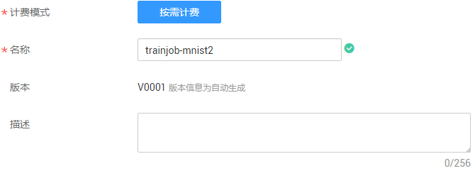
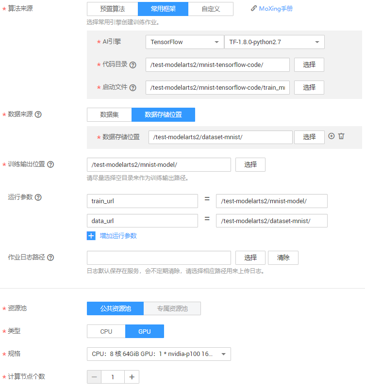
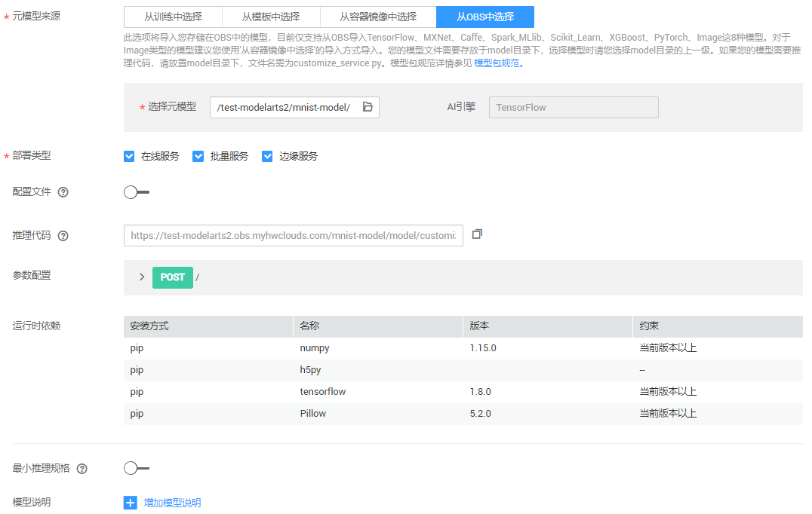
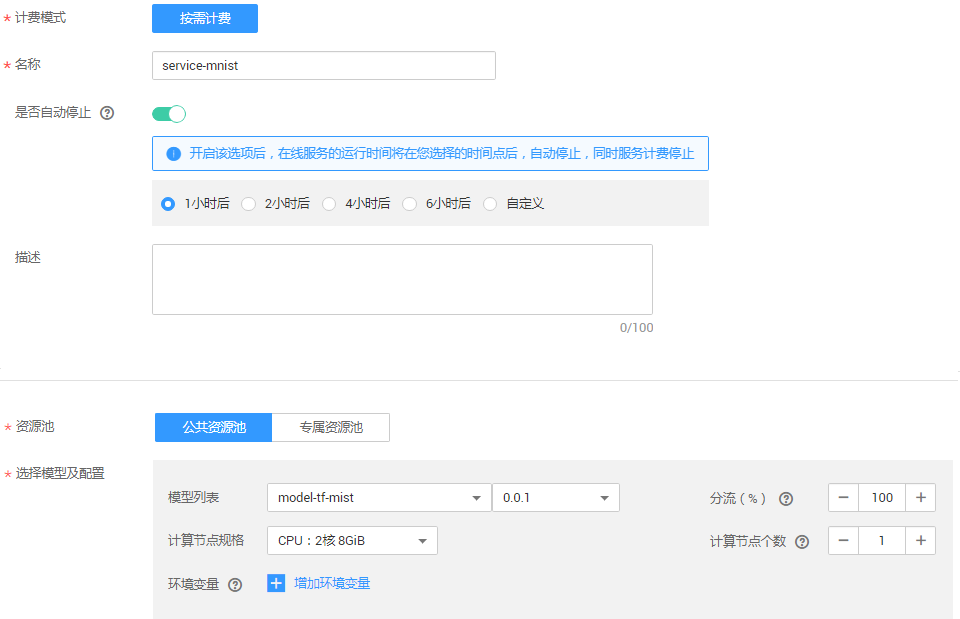
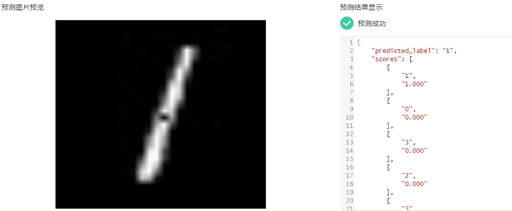

# 使用TensorFlow实现手写数字识别

本文介绍在华为云ModelArts平台如何使用TensorFlow实现MNIST数据集的手写数字图像识别应用。

开始使用如下样例前，请务必按[准备工作](#section51133584536)指导完成必要操作。使用TensorFlow实现手写数字图像识别样例的操作流程如下所示。

1.  **[准备数据](#section336312088)**：获取MNIST数据集，并上传至OBS。
2.  **[训练模型](#section42320342266)**：使用TensorFlow框架编写模型训练脚本，并新建训练作业进行模型训练。
3.  **[部署模型](#section740614592308)**：训练结束后，将模型导入ModelArts，并将模型部署为在线服务。
4.  **[预测结果](#section9961181112311)**：发起预测请求获取预测结果。

## 准备工作

-   已注册华为云账号，且在使用ModelArts前检查账号状态，账号不能处于欠费或冻结状态。
-   获取此账号的“AK/SK“，并在ModelArts全局配置中填写此信息，完成配置。
-   已在OBS服务中创建桶和文件夹，用于存放样例数据集以及模型。如下示例中，请创建命名为“test-modelarts“的桶，并创建如[表1](#zh-cn_topic_0168474775_table2061005120337)所示的文件夹。

    创建OBS桶和文件夹的操作指导请参见[创建桶](https://support.huaweicloud.com/usermanual-obs/obs_03_0306.html)和[新建文件夹](https://support.huaweicloud.com/usermanual-obs/obs_03_0316.html)。请确保您使用的OBS与ModelArts在同一区域。

    **表 1**  文件夹列表

    
    <table><thead align="left"><tr id="zh-cn_topic_0168474775_row1860945116333"><th class="cellrowborder" valign="top" width="31.180000000000003%" id="mcps1.2.3.1.1">
文件夹名称

    </th>
    <th class="cellrowborder" valign="top" width="68.82000000000001%" id="mcps1.2.3.1.2">
用途

    </th>
    </tr>
    </thead>
    <tbody><tr id="zh-cn_topic_0168474775_row06099518334"><td class="cellrowborder" valign="top" width="31.180000000000003%" headers="mcps1.2.3.1.1 ">
“dataset-mnist”

    </td>
    <td class="cellrowborder" valign="top" width="68.82000000000001%" headers="mcps1.2.3.1.2 ">
用于存储数据集。

    </td>
    </tr>
    <tr id="zh-cn_topic_0168474775_row1660955118338"><td class="cellrowborder" valign="top" width="31.180000000000003%" headers="mcps1.2.3.1.1 ">
“mnist-tensorflow-code”

    </td>
    <td class="cellrowborder" valign="top" width="68.82000000000001%" headers="mcps1.2.3.1.2 ">
用于存储训练脚本。

    </td>
    </tr>
    <tr id="zh-cn_topic_0168474775_row11609185115337"><td class="cellrowborder" valign="top" width="31.180000000000003%" headers="mcps1.2.3.1.1 ">
“mnist-model”

    </td>
    <td class="cellrowborder" valign="top" width="68.82000000000001%" headers="mcps1.2.3.1.2 ">
用于存储训练输出的模型和预测文件。

    </td>
    </tr>
    </tbody>
    </table>

-   针对此示例，ModelArts提供了部署上线需使用的训练脚本、推理代码和配置文件。请获取示例文件并上传OBS指定路径，详细请参见[表2](#zh-cn_topic_0168474775_table8311142123817)。

    1.  在gitee的[ModelArts-Lab](https://gitee.com/ModelArts/ModelArts-Lab)工程中，单击“克隆/下载“，然后单击“下载ZIP“，下载工程。
    2.  下载完成后，解压缩“ModelArts-Lab-master.zip“文件，然后在“\\ModelArts-Lab-master\\official\_examples\\Using\_TensorFlow\_to\_Create\_a\_MNIST\_Dataset\_Recognition\_Application\\codes“目录中获取到训练脚本“train\_mnist\_tf.py“、推理代码“customize\_service.py“和配置文件“config.json“，并上传至对应OBS路径。上传文件至OBS的操作指导请参见[上传文件](https://support.huaweicloud.com/usermanual-obs/obs_03_0307.html)。

    **表 2**  上传示例文件至OBS

    
    <table><thead align="left"><tr id="zh-cn_topic_0168474775_row173128427385"><th class="cellrowborder" valign="top" width="28.342834283428342%" id="mcps1.2.4.1.1">
文件名称

    </th>
    <th class="cellrowborder" valign="top" width="20.282028202820282%" id="mcps1.2.4.1.2">
描述

    </th>
    <th class="cellrowborder" valign="top" width="51.375137513751376%" id="mcps1.2.4.1.3">
上传至如下OBS路径中

    </th>
    </tr>
    </thead>
    <tbody><tr id="zh-cn_topic_0168474775_row193121442183816"><td class="cellrowborder" valign="top" width="28.342834283428342%" headers="mcps1.2.4.1.1 ">
“train_mnist_tf.py”

    </td>
    <td class="cellrowborder" valign="top" width="20.282028202820282%" headers="mcps1.2.4.1.2 ">
训练脚本。

    </td>
    <td class="cellrowborder" valign="top" width="51.375137513751376%" headers="mcps1.2.4.1.3 ">
“test-modelarts/mnist-tensorflow-code”

    </td>
    </tr>
    <tr id="zh-cn_topic_0168474775_row23121342143817"><td class="cellrowborder" valign="top" width="28.342834283428342%" headers="mcps1.2.4.1.1 ">
“customize_service.py”

    </td>
    <td class="cellrowborder" valign="top" width="20.282028202820282%" headers="mcps1.2.4.1.2 ">
推理代码。

    </td>
    <td class="cellrowborder" rowspan="2" valign="top" width="51.375137513751376%" headers="mcps1.2.4.1.3 ">
“test-modelarts/mnist-model/model”

    
 说明： 
<ul id="ul175761726142314"><li>请在训练作业完成后，再执行上传操作。</li><li>如果训练作业运行多次，将生成不同的版本，“mnist-model”目录下将生成多种版本的目录，如“V0001”、“V0002”，请基于训练作业的版本，将文件上传至对应版本下的“model”文件夹内。</li></ul>
    

    

    </td>
    </tr>
    <tr id="zh-cn_topic_0168474775_row13312114215389"><td class="cellrowborder" valign="top" headers="mcps1.2.4.1.1 ">
“config.json”

    </td>
    <td class="cellrowborder" valign="top" headers="mcps1.2.4.1.2 ">
配置文件。

    </td>
    </tr>
    </tbody>
    </table>

## 准备数据

ModelArts在公共OBS桶中提供了MNIST数据集，命名为“Mnist-Data-Set“，因此，本文的操作示例使用此数据集进行模型构建。您需要执行如下操作，将数据集上传至您的OBS目录下，即准备工作中您创建的OBS目录“test-modelarts/dataset-mnist“。

1.  单击[数据集下载链接](https://modelarts-cnnorth1-market-dataset.obs.cn-north-1.myhuaweicloud.com/dataset-market/Mnist-Data-Set/archiver/Mnist-Data-Set.zip)，将“Mnist-Data-Set“数据集下载至本地。
2.  在本地，将“Mnist-Data-Set.zip“压缩包解压。例如，解压至本地“Mnist-Data-Set“文件夹下。
3.  参考[上传文件](https://support.huaweicloud.com/usermanual-obs/obs_03_0307.html)，使用批量上传方式将“Mnist-Data-Set“文件夹下的所有文件上传至“test-modelarts/dataset-mnist“OBS路径下。

    “Mnist-Data-Set“数据集包含的内容如下所示，其中“.gz“为对应的压缩包。

    -   “t10k-images-idx3-ubyte“：验证集，共包含10000个样本。
    -   “t10k-images-idx3-ubyte.gz“：验证集的压缩包文件。
    -   “t10k-labels-idx1-ubyte“：验证集标签，共包含10000个样本的类别标签。
    -   “t10k-labels-idx1-ubyte.gz“：验证集标签的压缩包文件。
    -   “train-images-idx3-ubyte“：训练集，共包含60000个样本。
    -   “train-images-idx3-ubyte.gz“：训练集的压缩包文件。
    -   “train-labels-idx1-ubyte“：训练集标签，共包含60000个样本的类别标签。
    -   “train-labels-idx1-ubyte.gz“：训练集标签的压缩包文件。

## 训练模型

数据准备完成后，您需要使用TensorFlow编写训练脚本代码，ModelArts提供了一个编写好的代码示例“train\_mnist\_tf.py“，如下操作使用此示例训练模型。

1.  参考[准备工作](#section51133584536)的操作指导，将“train\_mnist\_tf.py“文件上传至OBS，例如“test-modelarts/mnist-tensorflow-code“。
2.  在ModelArts管理控制台，进入“训练管理 \> 训练作业“页面，单击左上角的“创建“。
3.  在“创建训练作业“页面，参考[图1](#fig15868125515112)和[图2](#fig12869655141111)填写相关信息，然后单击“下一步“。

    **图 1**  创建训练作业-填写基本信息  
    

    **图 2**  创建训练作业-填写详细参数  
    

4.  在“规格确认“页面，确认训练作业的参数信息，确认无误后单击“提交“。
5.  在训练作业管理页面，当训练作业变为“运行成功“时，即完成了模型训练过程。如有问题，可单击作业名称，进入作业详情界面查看训练作业日志信息。

    > **说明：**   
    >训练作业需要花费一些时间，预计十几分钟。当训练时间超过一定时间（如1个小时），请及时手动停止，释放资源。否则会导致欠费，尤其对于使用GPU训练的模型项目。  

6.  （可选）在模型训练的过程中或者完成后，可以通过创建可视化作业作业查看一些参数的统计信息。详细操作指导请参见[创建可视化作业](https://support.huaweicloud.com/engineers-modelarts/modelarts_23_0050.html)。

    其中，“训练输出位置“请选择步骤训练作业中“训练输出位置“参数中的路径，如“/test-modelarts/mnist-model/“。根据界面提示完成可视化作业创建。

## 部署模型

模型训练完成后，可以创建预测作业，将模型部署为在线预测服务。在部署模型之前，获取推理代码“customize\_service.py“和配置文件“config.json“并上传至OBS中。此推理代码和配置文件为ModelArts为操作样例提供的示例。您也可以基于[模型包规范](https://support.huaweicloud.com/engineers-modelarts/modelarts_23_0091.html)，开发自己所需的推理代码及配置文件。

1.  在部署模型之前，请参见[准备工作](#section51133584536)，将推理代码和配置文件上传至对应OBS路径下。本示例中模型输出位置的OBS路径为“test-modelarts/mnist-model/model“。
2.  在ModelArts管理控制台，单击左侧导航栏中的“模型管理\>模型“，进入“模型“页面，单击“导入“。
3.  在“导入模型“页面，参考[图3](#fig1391183516364)填写相关参数，然后单击“立即创建“。

    在“元模型来源“中，选择“从OBS中选择“页签。然后在“选择元模型“右侧文本框选择训练作业中“训练输出位置“指定的路径。

    **图 3**  导入模型  
    

    在“模型列表“页面，当模型状态变为“正常“时，表示模型已导入成功。

4.  单击模型名称左侧的小三角，打开此模型下的所有版本。在对应版本所在行，单击操作列“部署\>在线服务“，将模型部署为在线服务。

    在“部署“页面，参考[图4](#fig3534111012408)填写参数，然后根据界面提示完成在线服务创建。

    **图 4**  部署模型  
    

## 预测结果

完成模型部署后，等待服务部署完成，当服务状态显示为“运行中“，表示服务已部署成功。

1.  在“在线服务“页面，单击在线服务名称，进入服务详情页面。
2.  单击“预测“页签，在“选择预测图片文件“右侧，单击“上传“按钮选择一张黑底白字的图片，然后单击“预测“。

    预测完成后，预测结果显示区域将展示预测结果，根据预测结果内容，可识别出此图片的数字是“1“。

    > **说明：**   
    >-   由于推理代码和配置文件中已指定图片要求，用于预测的图片，大小必须为“28px\*28px“，且图片必须是黑底白字。  
    >-   建议不要使用数据集中自带的图片，可以使用Windows自带的画图工具绘制一张。  

    **图 5**  预测结果展示  
    

3.  如果不再需要使用此模型及在线服务，建议清除相关资源，避免产生不必要的费用。
    -   在“在线服务“页面，“停止“或“删除“刚创建的在线服务。
    -   在“模型管理“页面，“删除“刚导入的模型。
    -   在“训练作业“页面，“删除“运行结束的训练作业。
    -   进入OBS，删除本示例使用的OBS桶及文件夹，以及文件夹的文件。

